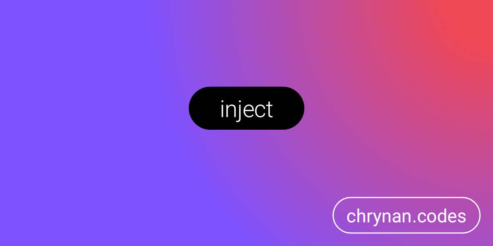

# Inject

A simple Kotlin multi-platform abstraction around
the [javax.inject](https://search.maven.org/artifact/javax.inject/javax.inject/1/jar) annotations. This allows using the
annotations in Kotlin common code so that platform specific annotation processors can register them. <br/>


For more information about the library, refer to the blog post [here](https://chrynan.codes/kotlin-inject/) which was
featured in Android Weekly issue [#396](https://androidweekly.net/issues/issue-396).
<br/><br/>
<a href="https://androidweekly.net/issues/issue-396" title="Android Weekly Issue 396">
</img>
</a>

The [blog post](https://chrynan.codes/kotlin-inject/) was also featured in Kotlin Weekly
issue [#182](https://mailchi.mp/kotlinweekly/kotlin-weekly-182).

## Getting Started 🏁

The library is provided through [repsy.io](https://repsy.io). Checkout
the [releases](https://github.com/chRyNaN/inject/releases) package to get the latest version. <br/>


### Repository

```kotlin
repositories {
    maven { url = "https://repo.repsy.io/mvn/chrynan/public" }
}
```

### Dependencies

```kotlin
implementation("com.chrynan.inject:inject:VERSION")
```

## Usage 👨‍💻

Simply use the provided annotations just as you would use
the [javax.inject](https://search.maven.org/artifact/javax.inject/javax.inject/1/jar) annotations.

For example, using the `Inject` annotation on a constructor in Kotlin Common code:

```kotlin
class MyUseCase @Inject constructor() { ... }
```

## Available annotations and interfaces

* `@Inject`
* `@Named("name")`
* `@Qualifier`
* `@Scope`
* `@Singleton`
* `Provider<T>`

## Documentation 📃

More detailed documentation is available in the [docs](docs) folder. The entry point to the documentation can be
found [here](docs/index.md).

## Security 🛡️

For security vulnerabilities, concerns, or issues, please responsibly disclose the information either by opening a
public GitHub Issue or reaching out to the project owner.

## Contributing ✍️

Outside contributions are welcome for this project. Please follow the [code of conduct](CODE_OF_CONDUCT.md)
and [coding conventions](CODING_CONVENTIONS.md) when contributing. If contributing code, please add thorough documents.
and tests. Thank you!

## Sponsorship ❤️

Support this project by [becoming a sponsor](https://www.buymeacoffee.com/chrynan) of my work! And make sure to give the
repository a ⭐

## License ⚖️

```
Copyright 2021 chRyNaN

Licensed under the Apache License, Version 2.0 (the "License");
you may not use this file except in compliance with the License.
You may obtain a copy of the License at

   http://www.apache.org/licenses/LICENSE-2.0

Unless required by applicable law or agreed to in writing, software
distributed under the License is distributed on an "AS IS" BASIS,
WITHOUT WARRANTIES OR CONDITIONS OF ANY KIND, either express or implied.
See the License for the specific language governing permissions and
limitations under the License.
```

The [javax.inject](https://search.maven.org/artifact/javax.inject/javax.inject/1/jar) library is also licensed under
the [Apache License 2.0](http://www.apache.org/licenses/LICENSE-2.0.txt).
